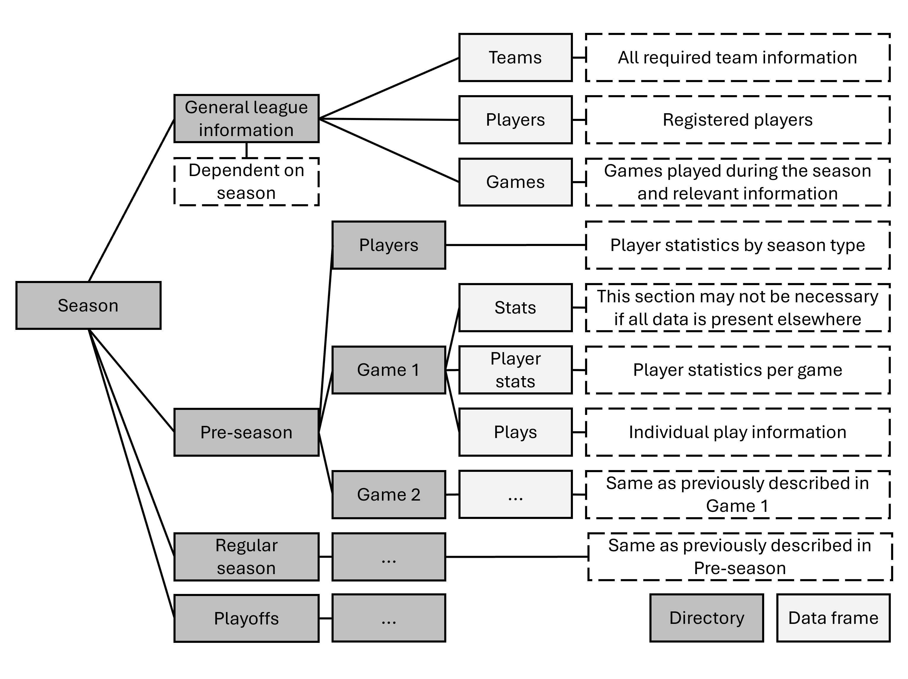

# **[SLAP-R](https://github.com/darkghastful/SLAP-R)**

The use of SLAPbase functions is preferable as they reduce API accession

SLAPbase structure: 

------------------------------------------------------------------------

## **Installation**

#### Important: Package is installed as SLAP-R and loaded as SLAP

<!-- From CRAN (when published) -->
<!-- install.packages("SLAP") -->

``` r
# install.packages("remotes")
install_github("darkghastful/SLAP-R")
```

------------------------------------------------------------------------

## **Quick Start**

### **Load the package**

``` r
library(SLAP)
```

### **Usage**

#### **Building a SLAPbase**

##### Identify season

``` r
season <- current.season() # Until the 20252026 season begins current.season() will return 
```

##### Select team

``` r
api.teams.by.season(season)
```

##### SLAP assembly

``` r
[SLAP(season, "STL")](#slap) # teamId, triCode and teamName are all supported inputs
```

#### **Functions**

#### **API Functions**

<!-- Disclaimer about API overuse -->

``` r
api.teams.by.season(season) 
api.players.by.season(season)
```

------------------------------------------------------------------------

## **Descriptions**

<!-- ### `SLAP()` -->
<!-- Description -->
<!-- - **Arguments** -->
<!--   - `arg` — Arg description. -->
<!-- - **Returns** -->
<!--   - returns - Return description. -->
<!-- ### **Example** -->
<!-- #### `function()` -->
<!-- Additional information. -->
<!-- ```{r scale, fig.width=12, fig.asp=90/212, dpi=300, echo=FALSE} -->
<!-- function() -->
<!-- ``` -->
<!-- ### `function()` -->
<!-- Description -->
<!-- - **Arguments** -->
<!--   - `arg` — Arg description. -->
<!-- - **Returns** -->
<!--   - returns - Return description. -->
<!-- ### **Example** -->
<!-- #### `function()` -->
<!-- Additional information. -->
<!-- ```{r scale, fig.width=12, fig.asp=90/212, dpi=300, echo=FALSE} -->
<!-- function() -->
<!-- ``` -->

------------------------------------------------------------------------

## **Dependencies**

- **bqutils**
- **stringr**  
- **jsonlite**
- **zip**

------------------------------------------------------------------------

## **License**

GPL-3.0 license © Bailey Quinn
