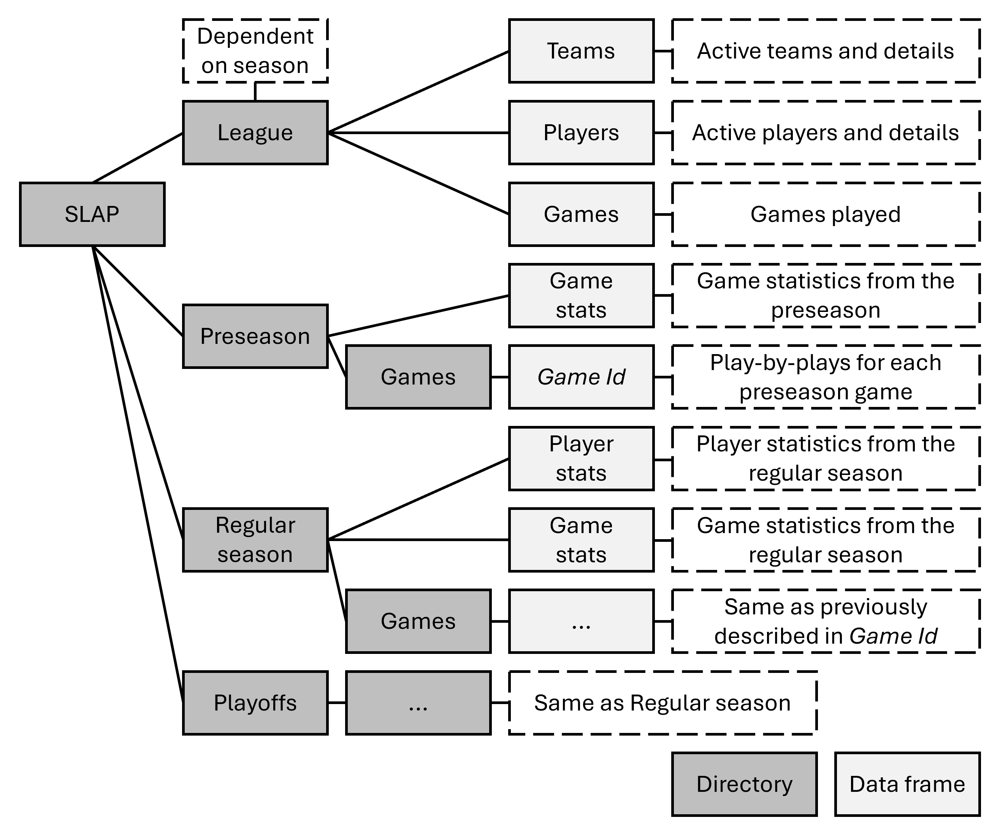

# **[SLAP-R](https://github.com/darkghastful/SLAP-R)**

The use of SLAPbase functions is preferable as they reduce API accession

SLAPbase structure: 

------------------------------------------------------------------------

## **Installation**

#### Important: Package is installed as SLAP-R and loaded as SLAP

<!-- From CRAN (when published) -->
<!-- install.packages("SLAP") -->

``` r
# install.packages("remotes")
install_github("darkghastful/SLAP-R")
```

------------------------------------------------------------------------

## **Usage**

### **Load**

``` r
library(SLAP)
```

### **Build a SLAPbase**

``` r
season <- "20242025" # Select season 
# season <- current.season() # Alternative

api.teams.by.season(season) # Select team

STL.20242025 <- SLAP(season, "STL") # [SLAPbase assembly](#slap)
```

### **Save SLAPbase**

``` r
SLAP.zip(STL.20242025, "STL_20242025.zip") # Save SLAPbase as a zip (for external use)
```

<!-- #### Identify season -->
<!-- ```{r, results = "hide", warning = FALSE, message = FALSE, eval=FALSE} -->
<!-- season <- current.season() # Until the 20252026 season begins current.season() will return 20242025 -->
<!-- ``` -->
<!-- #### Select team -->
<!-- ```{r, results = "hide", warning = FALSE, message = FALSE, eval=FALSE} -->
<!-- api.teams.by.season(season) -->
<!-- ``` -->
<!-- #### [SLAP assembly](#slap) -->
<!-- ```{r, results = "hide", warning = FALSE, message = FALSE, eval=FALSE} -->
<!-- SLAP(season, "STL") # teamId, triCode, and teamName are all supported inputs -->
<!-- ``` -->
<!-- ```{r, results = "hide", warning = FALSE, message = FALSE, eval=FALSE} -->
<!-- [SLAP(season, "STL")](#slap) # teamId, triCode and teamName are all supported inputs -->
<!-- ``` -->

### **Functionality**

``` r
SLAP.season(STL.20242025) # SLAPbase season
SLAP.team(STL.20242025) # Pull SLAPbase team
```

### **API Functions**

<!-- Disclaimer about API overuse -->

``` r
api.teams.by.season(season)
api.players.by.season(season)
api.games.by.season(season)
api.players.by.game.type(season, "STL", "regular.season")
```

------------------------------------------------------------------------

## **Descriptions**

### `api.games.by.season()`

api.games.by.season

- **Arguments**
  - `season` — season string
- **Returns**
  - returns - dataframe

### **Example**

#### `api.games.by.season()`

### `api.players.by.game.type()`

api.players.by.game.type

- **Arguments**
  - `season` — season string
  - `team` — triCode
  - `game.type` — choose one (“regular.season” or 2) (“playoffs” or 3)
- **Returns**
  - returns - dataframe

### **Example**

#### `api.players.by.game.type()`

### `api.players.by.season()`

api.players.by.season

- **Arguments**
  - `season` — season string
- **Returns**
  - returns - dataframe

### **Example**

#### `api.players.by.season()`

### `api.teams.by.season()`

Pulls the teams active in the provided season.

- **Arguments**
  - `season` — `string` Season identifier.
  - `all.teams` — `logical(1)` Include all past and current teams?
    Default `FALSE`
- **Returns**
  - returns - ‘data.frame’ A table containing team identifiers.

### **Example**

#### `api.teams.by.season()`

### `current.season()`

current.season

- **Arguments**
- **Returns**
  - returns - character

### **Example**

#### `current.season()`

### `showSLAP()`

SLAP

- **Arguments**
  - `object` — a `SLAPbase` object
- **Returns**
  - returns -

### **Example**

#### `showSLAP()`

### `SLAP()`

SLAP

- **Arguments**
  - `season` — season string
  - `team` — teamName, teamId, or triCode
  - `game.types` — list; select one or more c(“preseason”,
    “regular.season”, “playoffs”)
- **Returns**
  - returns - SLAP object

### **Example**

#### `SLAP()`

### `SLAP.season()`

SLAP.season

- **Arguments**
  - `SLAPbase` — SLAPbase
- **Returns**
  - returns - character

### **Example**

#### `SLAP.season()`

### `SLAP.team()`

SLAP.team

- **Arguments**
  - `SLAPbase` — SLAPbase
- **Returns**
  - returns - list(teamName, teamId, triCode)

### **Example**

#### `SLAP.team()`

### `SLAP.zip()`

SLAP.zip

- **Arguments**
  - `SLAPbase` — SLAPbase
  - `filename` — default is working dir/season.team.zip
- **Returns**
  - returns - zip save

### **Example**

#### `SLAP.zip()`

### `teamName.teamId.triCode()`

teamName.teamId.triCode

- **Arguments**
  - `team` — teamName, teamId, or triCode
  - `SLAPbase` — SLAPbase
- **Returns**
  - returns - list(teamName, teamId, triCode)

### **Example**

#### `teamName.teamId.triCode()`

------------------------------------------------------------------------

## **Dependencies**

- **bqutils**
- **stringr**  
- **jsonlite**
- **zip**

------------------------------------------------------------------------

## **License**

GPL-3.0 license © Bailey Quinn
